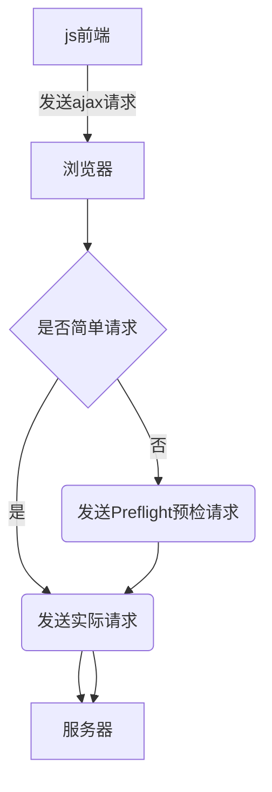

## 一、`cookie`的隔离与共享

### 配置host

```
127.0.0.1 	example.com
127.0.0.1 	a.example.com
127.0.0.1 	b.example.com
127.0.0.1 	x.a.example.com
127.0.0.1 	y.a.example.com

```


### 配置nginx

```nginx
server {
    listen  80;
    server_name  example.com a.example.com b.example.com x.a.example.com y.a.example.com;

    charset utf-8;

    access_log  /data/logs/nginx/example.access.log;
    error_log   /data/logs/nginx/example.error.log;

    location / {
        add_header Content-Type 'text/plain';

        return 200 '
        Host: $host
        Cookie: $http_cookie
';
    }

    location /api/ {
        rewrite ^/api/(.*)$ /$1 break;
        proxy_set_header host $host;
        proxy_pass http://localhost:8080;
    }
}

```


### 设置cookie

##### 注意：使用js设置cookie 和 通过Response使用Set-Cookie响应头设置cookie的语法和作用是一样的。

语法：
- 多个key-value值，使用分号“;”隔开，最后一个分号可写可不写；
- 属性值有 expires、path、domain、samesite、httponly、secure等；


```text

HTTP/1.1 200 OK
Server: nginx/1.18.0 (Ubuntu)
Content-Type: application/json
Transfer-Encoding: chunked
Connection: keep-alive
Cache-Control: no-cache, private
Date: Mon, 17 Nov 2025 02:14:30 GMT
Vary: Origin
Set-Cookie: r2=bbb
Set-Cookie: r1=aaa; domain=example.com
Set-Cookie: r=aaaa; expires=Mon, 17-Nov-2025 04:14:30 GMT; Max-Age=7200; path=/; domain=example.com; httponly; samesite=lax

```

1. example.com

```javascript

// 没有domain属性，则该cookie只能在本域名（example.com）使用
document.cookie='u1=a1'   // 没有设置domain属性，则该cookie只能在本域名（example.com）使用，其他域名都使用不了。

// 设置domain=example.com，则 example.com 和它的所有子域名（eg：example.com, a.example.com, b.example.com, x.a.example.com 等）都可以使用该cookie。
document.cookie='u2=ab; domain=example.com'
document.cookie='u2=ab; domain=.example.com'   // 作用同上。在现代浏览器中，domain=example.com 和 domain=.example.com 的效果是相同的，都表示匹配 example.com 及其所有子域名。但为了兼容性，通常推荐省略开头的点。

// 只能设置本域名和父域名的cookie，不能设置兄弟和子域名的cookie
document.cookie='u3=abc; domain=a.example.com'    // 注意：设置失败

// 查看本域名可以使用的cookie
document.cookie     // 使用js读取cookie（只能读取没有设置 httponly 属性的cookie）。
                    // 或者使用 DevTools -- Application -- Cookies 查看（可查看所有cookie）。

```

2. a.example.com

```javascript

// 没有domain属性，则该cookie只能在本域名（a.example.com）使用
document.cookie='a1=a'

// 设置domain=a.example.com，则 a.example.com 和它的所有子域名（eg：a.example.com, x.a.example.com 等）都可以使用该cookie。
document.cookie='a2=aa; domain=a.example.com'
// document.cookie='a2=aa; domain=.a.example.com'   // 作用同上。

document.cookie='a3=aaa; domain=example.com'

// 只能设置本域名和父域名的cookie，不能设置兄弟和子域名的cookie
document.cookie='a4=aaaa; domain=b.example.com'     // 注意：设置失败
document.cookie='a5-aaaaa; domain=x.a.eample.com'   // 注意：设置失败

// 查看本域名可以使用的cookie
document.cookie     // 'u2=ab; a1=a; a2=aa; a3=aaa'

```

3. b.example.com

```javascript

// 查看本域名可以使用的cookie
document.cookie     // 'u2=ab; a3=aaa'

```

4. x.a.example.com

```javascript

// 查看本域名可以使用的cookie
document.cookie     // 'u2=ab; a2=aa; a3=aaa'

```

## 二、`localStorage` 和 `sessionStorage` 的隔离与共享

todo

## 三、`cors`（跨域资源共享） 机制 与 `跨域请求`和携带登录状态

### 1.`cors`（跨域资源共享）原理和流程

1. 流程图
   


2. 浏览器如何鉴别`简单请求`和`非简单请求`
   1. 简单请求
   
      ```textarea
      当一个请求满足以下所有条件时，浏览器会将其视为简单请求：

      1.请求方法是 GET/POST/HEAD。
      2.仅包含浏览器自动设置的请求头（包括cookie）。
      3.如果包含 Content-Type 请求头，则值只能是以下之一：
        - application/x-www-form-urlencoded (普通表单提交)
        - multipart/form-data (文件上传)
        - text/plain (纯文本)

      ```
   2. 非简单请求
   
      ```textarea
      以下都是常见的非简单请求的例子：

      - 使用了 PUT, DELETE, CONNECT, OPTIONS, TRACE, PATCH 等请求方法。
      - 使用了自定义的请求头，例如 Authorization, X-Requested-With, Org-Id 等。
      - Content-Type 的值不是简单请求所允许的那三个值（例如 application/json）。

      ```


### 2.`Preflight`预检请求的请求方法、 `cors请求头` 和 `cors响应头`

##### 1.请求头方法是 `OPTIONS`

##### 2.`cors请求头`

| 请求头                             | 作用                                 | 说明                                                                                                                                                     |
| ---------------------------------- | ------------------------------------ | -------------------------------------------------------------------------------------------------------------------------------------------------------- |
| **Origin**                         | 标识请求来源                         | 浏览器自动添加，值为所在请求页面的协议 + 域名 + 端口，没有path。跨域请求必有这个请求头。<br>例如： `http://b.example.com ` 、`http://example.com:8080`。 |
| **Access-Control-Request-Method**  | 预检请求：告知后端实际请求方法       | 浏览器自动添加，仅在 `OPTIONS` 预检请求中出现。例如：`GET`、`POST`、`PUT`。                                                                              |
| **Access-Control-Request-Headers** | 预检请求：告知后端实际请求的自定义头 | 浏览器自动添加，仅在 `OPTIONS` 预检请求中出现，逗号分隔多个头名称。例如：`Content-Type, Authorization, Org-Id`。                                         |

##### 3.`cors响应头`

| 响应头                                 | 作用                 | 说明                                                                                                                                                           |
| -------------------------------------- | -------------------- | -------------------------------------------------------------------------------------------------------------------------------------------------------------- |
| **`Access-Control-Allow-Origin`**      | 允许的来源域         | 核心响应头。值可以是：<br/>- 具体域名：http://example.com。<br/>- 通配符：*（不允许携带认证信息时使用）。<br/>- 与请求头 Origin 一致的值（允许携带认证信息）。 |
| **`Access-Control-Allow-Methods`**     | 允许的请求方法       | 逗号分隔多个方法。例如：`GET, POST, PUT, DELETE, OPTIONS`。                                                                                                    |
| **`Access-Control-Allow-Headers`**     | 允许的自定义请求头   | 逗号分隔多个头名称。例如：`Content-Type, Authorization, Org-Id`。                                                                                              |
| **`Access-Control-Allow-Credentials`** | 是否允许携带认证信息 | 值为 true 或 false。<br/>- true：允许携带 Cookie 或 Token。<br/>- 此时 Access-Control-Allow-Origin 不能为 *。                                                  |
| **`Access-Control-Max-Age`**           | 预检请求的有效期     | 单位为秒。在有效期内，浏览器无需再次发送预检请求。例如：`86400`（24 小时）。                                                                                   |


### 3.实际请求的 `cors响应头`

| 响应头                                 | 作用                 | 说明                                                                                                                                                           |
| -------------------------------------- | -------------------- | -------------------------------------------------------------------------------------------------------------------------------------------------------------- |
| **`Access-Control-Allow-Origin`**      | 允许的来源域         | 核心响应头。值可以是：<br/>- 具体域名：http://example.com。<br/>- 通配符：*（不允许携带认证信息时使用）。<br/>- 与请求头 Origin 一致的值（允许携带认证信息）。 |
| **`Access-Control-Allow-Credentials`** | 是否允许携带认证信息 | 值为 true 或 false。<br/>- true：允许携带 Cookie 。<br/>- 此时 Access-Control-Allow-Origin 不能为 *。                                                          |
| **`Access-Control-Expose-Headers`**    | 允许前端访问的响应头 | 默认情况下，前端只能访问简单响应头（如 `Cache-Control`、`Content-Type`）。设置此头可以暴露其他自定义头。例如：`X-Total-Count`。                                |


### 4.什么情况下不会发送`Priflight`预检请求

1. 简单请求不会发送预检请求。
2. 前一次预检请求响应设置的 `Access-Control-Max-Age` 响应头还未失效。
   
#### 注意，`Access-Control-Max-Age` 响应头说明

1. `Access-Control-Max-Age` 响应头的值是数字，单位是秒，负数或者0表示立刻失效。比如 Access-Control-Max-Age: 3600；
2. 预检请求的响应头设置（包括`Access-Control-Max-Age`），是以uri隔离的

   ```textarea
   1. 实际请求的uri相同，但是请求方法不同，预检请求的响应结果的作用是互通的。
   比如：`POST http://a.example.com/api/debug` 导致的预检请求(`OPTIONS http://a.example.com/api/debug`)的响应结果也能作用到 `PUT http://a.example.com/api/debug`，反之也生效，因为二者触发的预检请求都是`OPTIONS http://a.example.com/api/debug`。

   2. 请求参数queryString不同，预检请求的响应结果的作用是独立的。 
   比如：`POST http://a.example.com/api/debug` 和 `POST http://a.example.com/api/debug?a=1` 导致的预检请求的响应结果是独立的。

   3. 请求的域名不同，预检请求的响应结果的作用的结果也是独立的。
   比如：`POST http://a.example.com/api/debug` 和 `POST http://x.a.example.com/api/debug` 导致的预检请求的响应结果也是独立的。

   ```


#### 注意，`Access-Control-Max-Age` 响应头失效的原因排查：

1. 浏览器清除了缓存；
2. 浏览器禁用了缓存；（比如：DevTools -- NetWork -- Disable cache）
3. 预检请求的响应，设置了禁用缓存的响应头，比如（但是使用chrome实测，即使设置了禁用缓存头，`Access-Control-Max-Age` 响应头还能生效）：
   
   ```textarea

   pragma: no-cache
   expires: -1

   ```


### 5.示例

1. laravel服务器
   
   ```php
   // options 预检请求
   Route::options('cors/debug', function (Request $request) {
       return response('')->withHeaders([
           // 预检请求跨域响应头
           'Access-Control-Allow-Origin' => $request->header('Origin'),    // 必须，根据请求动态设置
           'Access-Control-Allow-Credentials' => 'true',           // 如果实际请求需要携带cookie，这需要这个请求头，且设置为true

           // 'Access-Control-Allow-Methods' => 'GET, POST, PUT',     // 标明实际请求的方法
           'Access-Control-Allow-Methods' => $request->header('Access-Control-Request-Method'),    // 根据请求动态设置 

           // 'Access-Control-Allow-Headers' => 'content-type, h1',   // 标明实际请求需要携带的请求头
           'Access-Control-Allow-Headers' => $request->header('Access-Control-Request-Headers'),   // 根据请求动态设置
           
           'Access-Control-Max-Age' => '60',                       // 在有效期内，浏览器无需再次发送预检请求。单位秒。
       ]);
   })->withoutMiddleware(['web']);
   // 实际请求
   Route::match(['get', 'post', 'put'], 'cors/debug', function (Request $request) {
       return response([
           'cookies' => $request->header('cookie'),
           'h1' => $request->header('h1'),
           'content-type' => $request->header('content-type'),
           'datas' => $request->all(),
       ])->withHeaders([
                   // 实际请求跨域响应头
                   'Access-Control-Allow-Origin' => $request->header('Origin'),    // 必须，根据请求动态设置
                   'Access-Control-Allow-Credentials' => 'true',   // 如果实际请求需要携带cookie，这需要这个请求头，且设置为true
               ]);
   })->withoutMiddleware(['web']);

   ```

   启动服务器：
   ```shell
   php artisan serve --port=8080

   ```

2. 浏览器请求
   
   ```js
   // 在 http://b.example.com 页面的 console 执行

   // 请求1（简单请求）
   fetch("http://a.example.com/api/cors/debug", {
     "headers": {
     },
     "body": null,
     "method": "GET",
     "mode": "cors",
     "credentials": "include"
   });

   // 请求2，触发预检请求
   fetch("http://a.example.com/api/cors/debug", {
     "headers": {
       "content-type": "application/json",
       "h1": "v1",
     },
     "body": null,
     "method": "GET",
     "mode": "cors",
     "credentials": "include",  // 要求浏览器携带cookie
   });

   ```

3. 请求头和响应头
   
   1. 预检请求（OPTIONS）
   
   ```textarea
   ## 请求头
   OPTIONS /api/cors/debug HTTP/1.1
   Host: a.example.com
   Accept: */*
   Accept-Encoding: gzip, deflate
   Accept-Language: zh-CN,zh;q=0.9
   Origin: http://b.example.com
   Access-Control-Request-Headers: content-type,h1
   Access-Control-Request-Method: GET
   Connection: keep-alive
   Referer: http://b.example.com/
   Sec-Fetch-Mode: cors
   User-Agent: Mozilla/5.0 (Windows NT 10.0; Win64; x64) AppleWebKit/537.36 (KHTML, like Gecko) Chrome/142.0.0.0 Safari/537.36

   ## 响应头
   HTTP/1.1 200 OK
   Server: nginx/1.18.0 (Ubuntu)
   Date: Wed, 19 Nov 2025 09:46:04 GMT
   Content-Type: text/html; charset=UTF-8
   Transfer-Encoding: chunked
   Connection: keep-alive
   Host: a.example.com
   X-Powered-By: PHP/7.4.33
   Cache-Control: private, must-revalidate
   Access-Control-Allow-Origin: http://b.example.com
   Access-Control-Allow-Credentials: true
   Access-Control-Allow-Methods: GET
   Access-Control-Allow-Headers: content-type,h1
   Access-Control-Max-Age: 60
   pragma: no-cache
   expires: -1
   Content-Encoding: gzip

   ```

   2. 实际请求
   
   ```textarea
   ## 请求头
   GET /api/cors/debug HTTP/1.1
   Accept: */*
   Accept-Encoding: gzip, deflate
   Accept-Language: zh-CN,zh;q=0.9
   Connection: keep-alive
   Cookie: u2=ab; a1=a; a2=aa; a3=aaa
   Host: a.example.com
   Origin: http://b.example.com
   Referer: http://b.example.com/
   User-Agent: Mozilla/5.0 (Windows NT 10.0; Win64; x64) AppleWebKit/537.36 (KHTML, like Gecko) Chrome/142.0.0.0 Safari/537.36
   content-type: application/json
   h1: v1

   ## 响应头
   HTTP/1.1 200 OK
   Server: nginx/1.18.0 (Ubuntu)
   Date: Wed, 19 Nov 2025 09:46:04 GMT
   Content-Type: application/json
   Transfer-Encoding: chunked
   Connection: keep-alive
   Host: a.example.com
   Cache-Control: private, must-revalidate
   Access-Control-Allow-Origin: http://b.example.com
   Access-Control-Allow-Credentials: true
   pragma: no-cache
   expires: -1

   ```
